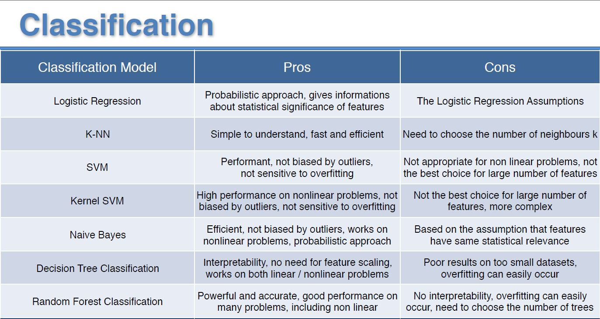

# Prediction Loan Repayments by Classification Models

## Supervised Learning
Supervised learning is the most common sub-branch of machine learning (ML) today. Typically, new machine learning practitioners will begin their journey with supervised learning algorithms.

### Supervised Machine Learning
Supervised machine learning algorithms are designed to learn by example. The name “supervised” learning originates from the idea that training this type of algorithm is like having a teacher supervise the whole process.
When training a supervised learning algorithm, the training data will consist of inputs paired with the correct outputs. During training, the algorithm will search for patterns in given data that correlate with the desired outputs. After training, a supervised learning algorithm will take in new unseen inputs and will determine which label the new inputs will be classified based on prior training data. The objective of a supervised learning model is to predict the correct label for newly presented input data. Basically, a supervised learning algorithm can be written simply as:
  **Y=F(X)** 
 
Where Y is the predicted output that is determined by a mapping function that assigns a class to an input value x. The function used to connect input features to a predicted output is created by the machine learning model during the data training.
Supervised learning uses a training set to teach models to yield the desired output. This training dataset includes inputs and correct outputs, which allow the model to learn over time. The algorithm measures its accuracy through the loss function, adjusting until the error has been sufficiently minimized.
Supervised learning can be separated into two types of data mining problems; classification and regression, where the classification is explaied in this section.

## Classification
Classification uses an algorithm to accurately assign test data into specific categories. It recognizes specific entities within the dataset and attempts to draw some conclusions on how those entities should be labeled or defined. Common classification algorithms are linear classifiers, support vector machines, decision trees, k-nearest neighbor, and random forest, which are described in more detail below.

### Logistic Regression
Logistic regression is another powerful supervised ML algorithm used for binary classification problems when the target is categorical. In fact, logistic regression is a linear regression for classification problems. It is a process of modeling the probability of a discrete outcome given an input variable. The most common logistic regression model is a binary outcome which can take two values such as true/false, yes/no, etc., that is designed to meet  the classification purpose very useful for understanding the influence of several independent variables on a single outcome variable.

### Naive Bayes
Naive Bayes provides a way that calculates the probability of a piece of data belonging to a given class with prior knowledge. It is a classification algorithm for binary and multiclass classification problems. It is called Naive Bayes or idiot Bayes because the calculations of the probabilities for each class are simplified to make their calculations tractable.

### K-Nearest Neighbours
The k-nearest neighbors (KNN) algorithm is a simple, supervised machine learning algorithm that can be used to solve both classification and regression problems. KNN tries to predict the correct class for the test data by calculating the distance between the test data and all the training points. Then select the K number of points which is closet to the test data. The KNN algorithm calculates the probability of the test data belonging to the classes of ‘K’ training data and class holds the highest probability will be selected. KNN is easy to implement and understand, but has a major drawback of becoming significantly slows when the size of used dataset grows.

### Decision Tree
Decision tree builds classification or regression models in the form of a tree structure. It utilizes an if-then rule set which is mutually exclusive and exhaustive for classification. The rules are learned sequentially using the training data one at a time. Each time a rule is learned, the tuples covered by the rules are removed. This process is continued on the training set until meeting a termination condition. The decision tree is constructed in a top-down recursive divide-and-conquer manner. All attributes should be categorical. Otherwise, they should be discretized in advance. Attributes in the top of the tree have more impact towards in the classification and they are identified using the information gain concept. 

A decision tree can be easily over-fitted generating too many branches and may reflect anomalies due to noise or outliers. An over-fitted model has a very poor performance on data prediction even though it gives an impressive performance on training data. This can be avoided by pre-pruning which stops tree construction early or post-pruning which removes branches from the fully grown tree.

### Random Forest
Random forest classifier is a meta-estimator that fits a number of decision trees on various sub-samples of datasets and uses average to improve the predictive accuracy of the model and controls over-fitting. The sub-sample size is always the same as the original input sample size but the samples are drawn with replacement.

### Support Vector Machine
The support vector machine (SVM) is a classifier that represents the training data as points in space separated into categories by a gap as wide as possible. New points are then added to space by predicting which category they fall into and which space they will belong to. A SVM is a supervised ML model that uses classification algorithms for two-group classification problems. After giving an SVM model sets of labeled training data for each category, they enable to categorize new text. A SVM takes these data points and outputs the hyperplane (i.e., two dimensions as a line) that best separates the tags. This line is the decision boundary. Support vectors are data points that are closer to the hyperplane and influence the position and orientation of the hyperplane. The margin of the classifier are maximised by using these support vectors. Deleting the support vectors will change the position of the hyperplane. 

## K-fold Cross-Validation
The k-fold cross-validation procedure is a standard method for estimating the performance of a ML algorithm or configuration on a dataset. Use cross-validation to detect overfitting, failing to generalize a pattern. In the classification model it used to find the the highest accuracy by using the optimal hyperparameters.

A single run of the k-fold cross-validation procedure may result in a noisy estimate of model performance. Different splits of the data may result in very different outcomes. Repeated k-fold cross-validation provides a way to improve the estimated performance of a ML model. This involves simply repeating the cross-validation procedure multiple times and reporting the mean result across all folds from all runs. This mean result is expected to be a more accurate estimate of the true unknown underlying mean performance of the model on the dataset, as calculated using the standard error.

## Grid Search
Grid search allows to find the optimal values of the hyperparameters in any model to get higher accuracy. Hyperparameter optimization or tuning is the problem of choosing a set of optimal hyperparameters for a learning algorithm. A hyperparameter is a parameter whose value is used to control the learning process. By contrast, the values of other parameters (typically node weights) are learned. 

#### Parameter vs. Hyperparameter in a ML learning model
A model parameter is a configuration variable that is internal to the model and whose value can be estimated from the given data.
 •	Required by the model when making predictions.
 •	Their values define the skill of the model on your problem.
 •	Estimated or learned from data. 

A model hyperparameter is a configuration that is external to the model and whose value cannot be estimated from data.
 •	Often used in processes to help estimate model parameters.
 •	Often specified by the practitioner.
 •	Often be set using heuristics. 

## Pros and Cons of various Machine Learning Regression algorithms: 

***In order to chose the best model for our data, the performance of each model on the data set is carefully considered.***

### 

## Dataset Explanation
This repository contains Python implementation of the supervised learning algorithms selected for predicting Loan repayments.

In this project, publicly available data from LendingClub.com.are explored. Lending Club connects borrowers with investors. Hopefully, any investor would want to invest in people who showed a profile of having a high probability of payback. An optimised model that will help predict this packback is then highly desirable.

Lending club had a very interesting year in 2016, so let's check out some of their data and keep the context in mind. lending data from 2007-2010 are used in an attempt to classify and predict whether or not the borrower paid back their loan in full. You can download the data from here or just use the csv already provided as it has been cleaned of NA values.

Here are what the columns represent:
 •	credit.policy: 1 if the customer meets the credit underwriting criteria of LendingClub.com, and 0 otherwise.
 •	purpose: The purpose of the loan (takes values "credit_card", "debt_consolidation", "educational", "major_purchase", "small_business", and "all_other").
 •	int.rate: The interest rate of the loan, as a proportion (a rate of 11% would be stored as 0.11). Borrowers judged by LendingClub.com to be more risky are assigned higher interest rates.
 •	installment: The monthly installments owed by the borrower if the loan is funded.
 •	log.annual.inc: The natural log of the self-reported annual income of the borrower.
 •	dti: The debt-to-income ratio of the borrower (amount of debt divided by annual income).
 •	fico: The FICO credit score of the borrower.
 •	days.with.cr.line: The number of days the borrower has had a credit line.
 •	revol.bal: The borrower's revolving balance (amount unpaid at the end of the credit card billing cycle).
 •	revol.util: The borrower's revolving line utilization rate (the amount of the credit line used relative to total credit available).
 •	inq.last.6mths: The borrower's number of inquiries by creditors in the last 6 months.
 •	delinq.2yrs: The number of times the borrower had been 30+ days past due on a payment in the past 2 years.
 •	pub.rec: The borrower's number of derogatory public records (bankruptcy filings, tax liens, or judgments).
